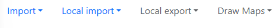
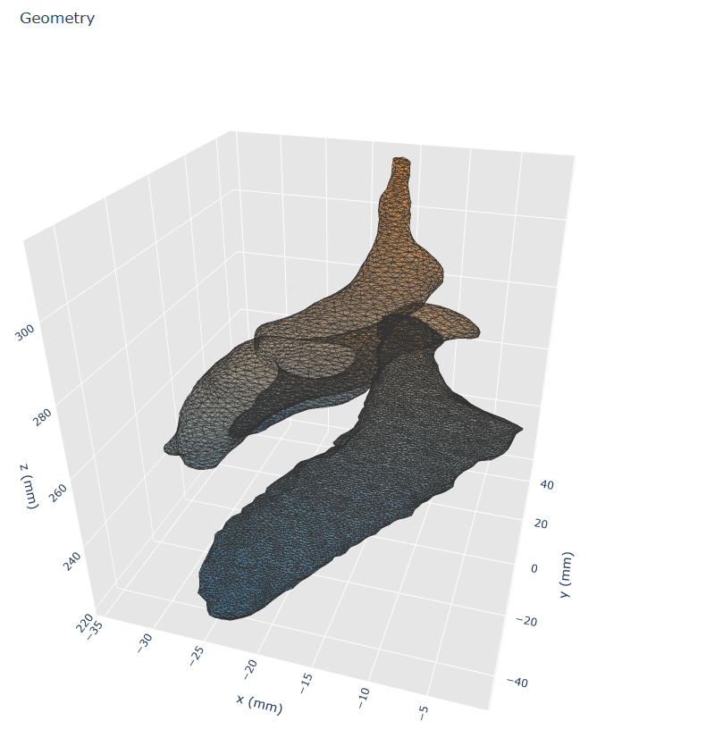
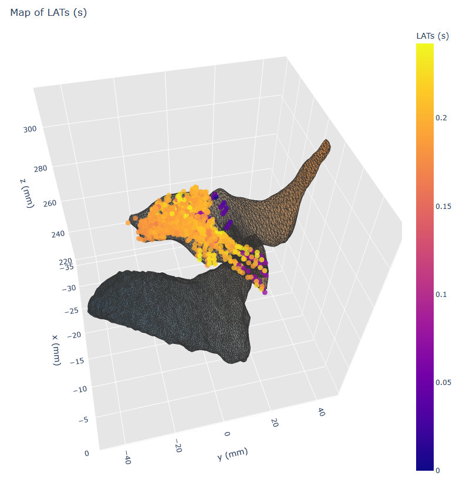
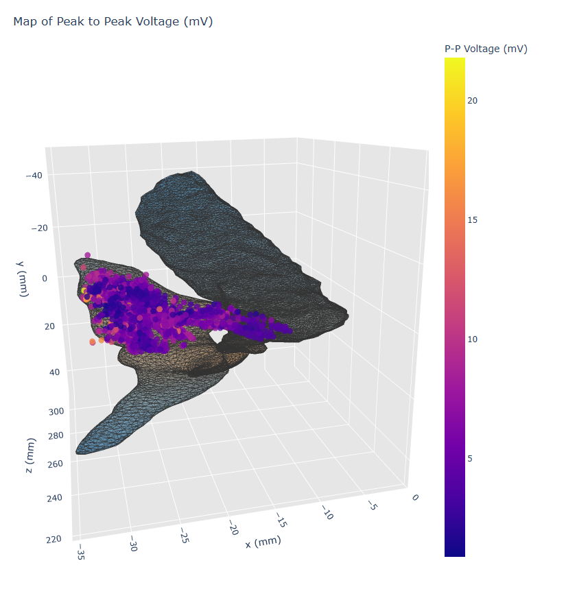
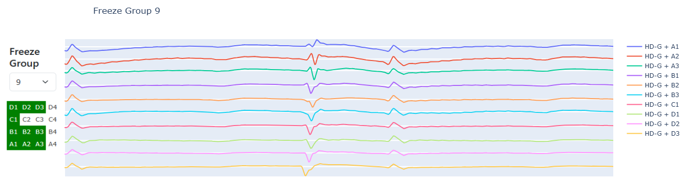
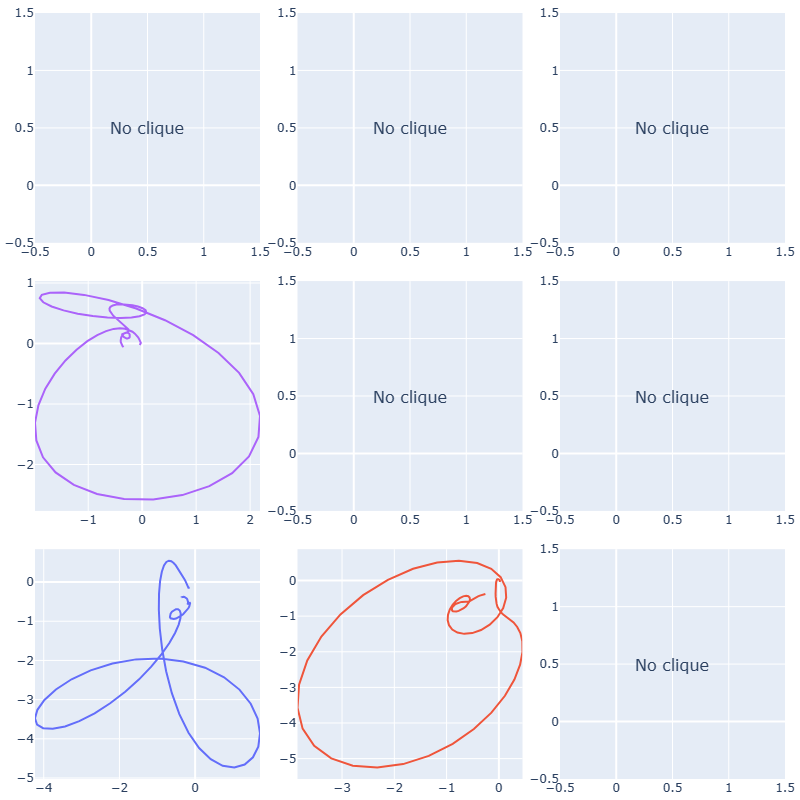
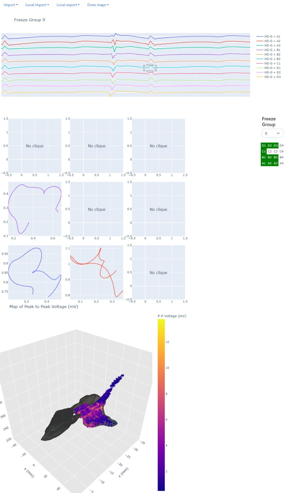

# PS2 Cardiac Electrophysiology

Python, Dash and Plotly app for analyzing cardiac electrophysiology data.

## How to run

1. Install dependencies:

```bash
pip install -r requirements.txt
```

2. Run the app:

```bash
python main.py
```

3. Open web browser and go to the address shown in the terminal to view the app.

To avoid any conflicts, it is highly recommended to use a [virtual environment](https://docs.python.org/3/library/venv.html) for installing the dependencies.

## Compatible formats

### Geometry data

Geometry data should be in `.xml` with the following structure:

```xml
<DIF>
    <DIFBody>
        <Volume>
            <Vertices>
                ...
                -34.1004  26.8820  224.2449
                -33.5852  26.7199  224.6685
                -34.0837  26.3541  224.4417
                ...
            </Vertices>
            <Polygons>
                ...
                6 4 7
                2 8 3
                1 4 5
                ...
        </Volume>
    </DIFBody>
</DIF>
```

where each line in `<Vertices>` contains the x, y and z coordinates of a vertex, and each line in `<Polygons>` contains the indices of the vertices that make up a polygon (index starting from 1).

### Recording data

Recording data should be in `.csv` files with a _header_ and _body_ separated by a line containing only:

```csv
Begin Data
```

The header of each file should include details about the total number of files comprising the recording and the current file's sequence number in a format:

```csv
<number> of <total>
```

where `<number>` is the number of the current file and `<total>` is the total number of files. This text could be anywhere in the header. Rest of the header is not currently used. Missing of this line will not result in an error, but may lead to an incorrect order of recordings.

for example:

```csv
...
Total number of data points (columns):, 256
This is file 1 of 8 for map,PP RV
Points sorted in order of acceptance (first to last)
...
```

Body of each file should contain data in blocks separated by an empty line. First block should contain data in rows, where each row contains the name of measured variable and then its values, for example:

```csv
...
pt number,1,2,3...
ref trace,ECG I,ECG II,ECG III,...
roving x,-23.530,-23.435,-23.445,...
...
```

which will be read as:

| ... | pt number | ref trace | roving x | ... |
| --- | --------: | :-------- | -------: | --- |
| ... |         1 | ECG I     |  -23.530 | ... |
| ... |         2 | ECG II    |  -23.435 | ... |
| ... |         3 | ECG III   |  -23.445 | ... |

**In order for the app to work, the following variables are obligatory:**

- `pt number`
- `rov LAT`
- `peak2peak`
- `roving x`
- `roving y`
- `roving z`

Each block should contain data in a format:

```csv
...

<block name>,<channel 1>,<channel 2>,<channel 3>,...
,<value 1 for channel 1>,<value 1 for channel 2>,<value 1 for channel 3>,...
,<value 2 for channel 1>,<value 2 for channel 2>,<value 2 for channel 3>,...
,...
```

for example:

```csv
...

rov trace:,HD-G + A1,HD-G + A2,HD-G + A3,HD-G + B1,..
,-1.6010,-1.2350,-0.9280,-1.5960,...
,-1.6010,-1.2350,-0.9280,-1.5960,...
...
```

**In order for the app to work, the following blocks are obligatory:**

- `rov trace`

Channel names in the `rov trace` may be in any format, but if they are unipolar signals, they should contain the name of the electrode they are measured from in the consisting of the letter (A, B, C, D) followed by the number (1, 2, 3, 4). For example: `HD-G + A1` or `HD-G + B2`. This is necessary for the app to be able to calculate the omnipolar signals.

If this is not the case, or the name contains more than one fitting letter-number combination, the app will still work, but the omnipolar plots and map of available recordings for each electrode will not be available.

For example, the block from an example above will be read as block named `rov trace` of data:

|   x |   y | label     |       1 |       2 | ... |
| --: | --: | :-------- | ------: | ------: | --- |
|   0 |   0 | HD-G + A1 | -1.6010 | -1.6010 | ... |
|   1 |   0 | HD-G + A2 | -1.2350 | -1.2350 | ... |
|   2 |   0 | HD-G + A3 | -0.9280 | -0.9280 | ... |
|   0 |   1 | HD-G + B1 | -1.5960 | -1.5960 | ... |
| ... | ... | ...       |     ... |     ... | ... |

but a block structured like this:

```csv
rov trace,HD-G A1-A2,HD-G A2-A3,HD-G A3-A4,HD-G B1-B2,...
,-1.6010,-1.2350,-0.9280,-1.5960,...
,-1.6010,-1.2350,-0.9280,-1.5960,...
...
```

will be read as:

| x   | y   | label      |       1 |       2 | ... |
| :-- | :-- | :--------- | ------: | ------: | --- |
| NaN | NaN | HD-G A1-A2 | -1.6010 | -1.6010 | ... |
| NaN | NaN | HD-G A2-A3 | -1.2350 | -1.2350 | ... |
| NaN | NaN | HD-G A3-A4 | -0.9280 | -0.9280 | ... |
| NaN | NaN | HD-G B1-B2 | -1.5960 | -1.5960 | ... |
| ... | ... | ...        |     ... |     ... | ... |

and will result in restricted functionality of the app, as described above.

## How to use

### Loading data

Upon opening the app, the user is greeted greeted with a a blank screen containing a header navigation on the top.



There are two types of ways to load data into the app:

- _Import_ - managed by Dash. Allows for uploading the data from client's computer to a server that may be running on a different machine. This is a slower method, as Dash only allows for loading all files at once, and they have to be base64 encoded and then decoded again.
- _Local import_ - managed by tkinter. This method is much faster, but will only works if the server is running localy.

After choosing the method of loading data, the user is be prompted to choose the files to load. At least one DxL `.csv` file and an optional `.xml` need to be select. If multiple `.xml` files are chosen, only the first one will be used.

_Local import_ also allows for uploading a `.pkl` file containing the data that was previously loaded into the app. This is useful if the user wants to quickly come back to the data that was previously used.

### Geometry

If a `.xml` file was loaded correctly, automatically a 3D geometry of the heart will be displayed. Plot can be rotated by clicking and dragging on it or zoomed in and out using the mouse wheel.



The _Draw maps_ header menu will also become available. From this menu the user can choose to plot the _Local activation times_, _Peak to peak voltage of uEGMs_ or to clear the previously plotted maps.





### Signals

After loading the data, on the right side of the screen a dropdown menu with detected _Freeze groups_ will appear. Choosing one of them will display corresponding signals, and if the names of the channels are in the correct format (as described in [Recording data](#recording-data)), also the map of electrodes used in the recording.



### Omnipole plots

If the names of the channels are in the correct format (as described in [Recording data](#recording-data)), the user will be able to plot omnipole plots. This can be done by clicking and dragging on the signals plot, to select the range of the data that should be used. After releasing the mouse button, the omnipole plot will plotted in 3x3 grid corresponding to the 9 "L" shaped electrodes groups that can be formed from the 4x4 grid of electrodes. If there is no data to calculate the omnipole plot, the plot will be empty with a message saying "No clique".



## Whole page screenshot


